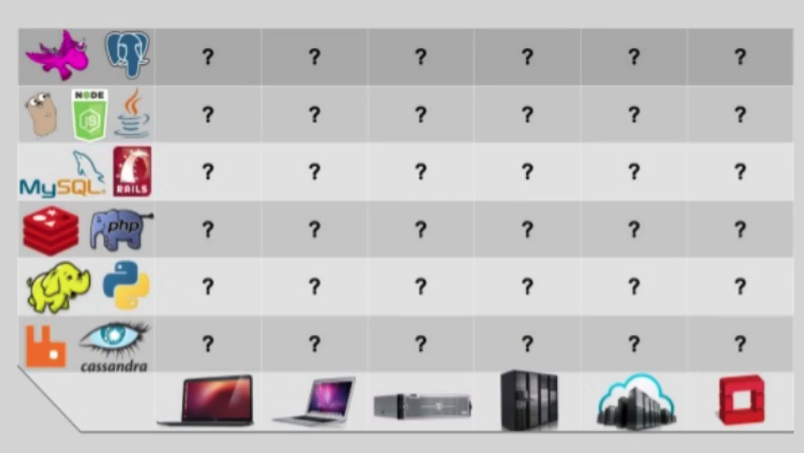

# Curso da Udemy
* [Link do curso](https://www.udemy.com/course/docker-para-desenvolvedores-com-docker-swarm-e-kubernetes)
* [Link do material](https://github.com/matheusbattisti/curso_docker)


# Trabalhando com Containers

## O que é Docker?

* O **Docker** é um software que **reduz a complexidade de setup** de aplicações;
* Onde **configuramos containers**, que são como servidores para rodar nossas aplicações;
* Com facilidade, podemos criar **ambientes independentes** e que funcionam em diversos SO's;
* E ainda deixa os projetos **performáticos**;

## Por quê Docker?

* O Docker proporciona mais velocidade na configuração do ambiente de um dev;
* **Pouco tempo gasto em manutenção**, containers são executados como configurados;
* **Performance** para executar aplicação, mais performático que uma VM;
* Nos livra da **Matrix from Hell**;

# Conhecendo a Matrix from Hell



## Diferença das versões de Docker

### Qual versão utilizar?

* O **Docker** é dividido em duas versões: **CE x EE**
* CE é a **Community Edition**, edição gratuita, que nos possibilita utilizar o Docker normalmente, é a que vamos optar;
* EE é a **Enterprise Edition**, edição paga, há uma garantia maior das versões que são disponibilizadas e você tem suporte do time do Docker;

## Testando o Docker!

* Vamos testar o Docker utilizando uma **imagem real**;
* Para rodar containers utilizamos o comando **docker run**;
* Neste comando **podemos passar diversos parâmetros**;
* Neste exemplo vamos passar apenas o nome da imagem que é **docker/whalesay**
* Um comando chamado cowsay e uma mensage;

```docker

<!-- cowsay envia mensagem para o container -->
<!-- Vai ver se existe a imagem de forma local para fazer o cache -->
<!-- Se nao conseguir vai puxar a imagem no repositório docker -->
<!-- executa o que a imagem possui em forma de container e retorna o resultado -->
docker run docker/walesay cowsay Hello_World

```

## O que são containers?

* Um **pacote de código que pode executar uma ação**, por exemplo: rodar uma aplicação de Node.js, PHP, Python e etc;
* Ou seja, os nossos projetos serão executados dentro dos containers que criarmosutilizarmos;
* **Containers utilizam imagens** para poderes ser executados;
* **Múltiplos containers podem rodar juntos**, exemplo: um para PHP e outro para MySQL

## Container X Imagem

* **Imagem e Container** são recursos fundamentais do Docker;
* Imagem é o **"projeto"** que será executado pelo container, todas as instruções estarão declaradas nela;
* Container é o **Docker rodando alguma imagem**, consequentemente executando algum código proposto por ela;
* O fluxo é: programamos uma imagem e a executamos por meio de um container;

## Onde encontrar imagens?
* Vamos encontrar imagens no repositório do Docker: <https://hub.docker.com>
* Neste site podemos **verificar quais as imagens existem** da tecnologia que estamos procurando, por exemplo: Node.js;
* E também aprender a como utilizá-las;
* Vamos executar uma imagem em um container com o comando: 

```docker
docker run <imagem>

<!-- download ubuntu:latest -->
docker run ubuntu

<!-- Abre o container com o terminal e voce consegue acessar tudo dentro do ubuntu -->
docker run -it ubuntu

<!-- Mostra os containers rodando -->
docker ps

```

## Verificar containers executados

* O comando **docker ps (versão antiga) ou docker container ls(versão recente)** exibe quais containers estão sendo executados no momento;
* Utilizando a flag -a, temos também todos os containers já executados na máquina;
* Este comando é útil para **entender o que está sendo executado e acontece** no nosso ambiente;

```docker

<!-- MOSTRA OS CONTAINERS RODANDO QUE ESTAO ATIVOS -->
docker ps

<!-- EXECUTA UM NOVO CONTAINER -->
docker run ubuntu

<!-- APARECE SOMENTE OS ATIVOS -->
docker ps

<!-- APARECE OS CONTAINERS EXECUTADOS -->
docker ps -a


```

## Executar container com interação

* Podemos rodar um container e deixá-lo **executando no terminal**;
* Vamos utilizar a **flag -it**;
* Desta maneira **podemos executar comandos disponíveis no container** que estamos utilizando o comando run;
* Podemos utilizar a imagem do ubuntu para isso!

```docker

<!-- ABRE TERMINAL COM JAVASCRIPT -->
docker run -it node

<!-- VOCE PODE EXECUTAR CÓDIGO JAVASCRIPT -->

```

## Container X VM (Virtual Machine)

* **Container é uma aplicação que serve para um determinado fim**, não possui sistema operacional, seu tamanho é de alguns mbs;
* VM possui sistema operacional próprio, tamanho de gbs, **pode executar diversas funções ao mesmo tempo**;
* Containers acabam gastando menos recursos para serem executados, por causa do seu uso específico;
* VMs gastam mais recursos, porém podem exercer mais funções;

## Executar container em background

* Quando iniciamos um container que persiste, **ele fica ocupando o terminal**;
* Podemos exeutar um container em background, para não precisar ficar com diversas abas de terminal aberto, utilizamos a **flag -d** (detached);
* Verificamos **containers em background com docker ps** também;
* Podemos utilizar o nginx para este exemplo!

```docker

<!-- nginx servidor web como se fosse apache -->
docker run nginx

<!-- PARA CONTAINER -->
docker stop <NOME_DO_CONTAINER>

<!-- NOME NAO VAI MAIS APARECER -->
docker ps

<!-- RODA EM BACKGROUND -->
docker run -d nginx

```

## Expor portas

* Os **containers de docker não tem conexão com nada de fora deles**;
* Por isso precisamos expor portas, a **flag é a -p** e podemos fazer assim: -p 80:80
* Desta maneira **o container estará acessível na porta 80**;
* Podemos testar este exemplo com o nginx!

```

<!-- DETACHED E EXPONDO A PORTA -->
docker run -d -p 80:80 nginx

docker stop <NOME_DO_CONTAINER>

<!-- PRIMEIRA PORTA A QUE VOCE QUER EXPOR NA SUA MÁQUINA -->
dokcer run -d -p 3000:80 nginx

```


## Parando containers

* Podemos parar um container com o comando **docker stop </id ou nome_do_container/>**

* Desta maneira estaremos liberando recursos que estão sendo gastos peolo mesmo;

* Podemos verificar os containers rodando com o comando **docker ps**;


## Iniciando container

* Aprendemos já a parar um container com o stop, para voltar a rodar um container podemos usar o comando **docker start </id/>**;
* Lembre-se que **o run sempre cria um novo container**;
* Então caso seja necessário aproveitar um antigo, opte pelo start;


## Definindo nome do container

* Podemos definir um nome do container com a flag **--name**;
* Se não colocamos, **recebemos um nome aleatório**, o que pode ser um problema para uma aplicação profissional;
* A flag run é inserida junto do **comando run**;


```docker

docker run -d -p 80:80 --name nginx_app_name nginx

docker stop nginx_app_name

docker start nginx_app_name

```

## Verificando os logs

* Podemos **verificar o que aconteceu em um container** com o comando logs;
* Utilizamos da seguinte maneira: **docker logs ID_DO_CONTAINER**;
* As últimas ações realizadas no container, serão **exibidas no terminal**;

```docker

docker logs nginx_app

<!-- -f Significa follow - vai seguir os novos logs -->
docker logs -f nginx_app_name

```

## Removendo container

* Podemos **remover um container da máquina** que estamos executando o Docker;
* O comando é **docker -rm ID_DO_CONTAINER**;
* Se o container estiver rodando ainda, podemos utlizar a **flag -f (force)**;
* O container removido não é mais listado em docker ps -a;


# Criando imagens e avançando em containers

## O que são imagens?

* Imagens **são originadas de arquivos que programamos** para que o Docker crie uma estrutura que execute determinadas ações em containers;
* Elas contém informações como: imagens base, diretório base, comandos a serem executados, porta da aplicação e etc;
* Ao rodar um container baseado na imagem, **as instruções serão executadas em camadas**;


## Como escolher uma boa imagem

* Podemos fazer download das imagens em: https://hub.docker.com;
* Porém **qualquer um pode fazer upload de uma imagem**, isso é um problema;
* Devemos então nos atentar as **imagens oficiais**;
* Outro parâmetro interessante é a **quantidade de download** e a **quantidade de stars**;

## Criando uma imagem

* Para criar uma imagem vamos precisar de um arquivo **Dockerfile** em uma pasta que ficará o projeto;
* Este arquivo vai precisar de algumas instruções para poder ser executado;
* **FROM**: imagem base;
* **WORKDIR**: diretório da aplicação;
* **EXPOSE**: porta da aplicação;
* **COPY**: quais arquivos precisam ser copiados;


## Executando uma imagem

* Para executar a imagem primeiramente **vamos precisar fazer o build**;
* O comando é **docker build DIRETORIO_DA_IMAGEM**;
* Depois vamos utilizar o **docker run IMAGEM** para executá-la


```docker

<!-- LISTAR IMAGEM -->
docker image ls

docker run ID_IMAGEM

docker run -d -p 3000:3000 ID_IMAGEM

docker run -d -p 3000:3000 --name ID_IMAGEM
```

## Alterando uma imagem

* Sempre que alterarmos o código de uma imagem **vamos precisar fazer o build novamente**;
* Para o Docker é como se fosse **uma imagem completamente nova**;
* Após fazer o build vamos executá-la por o outro id único criada com o docker run;

## Camadas das imagens

* As imagens do Docker são divididas em **camadas** (layers);
* Cada instrução no Dockerfile **representa uma layer**;
* Quando algo é utilizado **apenas as layers depois da linha atualiazada são refeitas**;
* O resto permanece em cache, tornando o **build mais rápido**;

## Download de imagens

* Podemos **fazer o download de alguma imagem** do hub e deixá-la disponível em nosso ambinete;
* Vamos utilizar o comando **docker pull <imagem>**;
* Desta maneira, caso se use em outro container, **a imagem já estará pronta para ser utilizada**;

## Aprender mais sobre os comandos

* Todo comando no docker tem acesso a uma **flag --help**;
* Utilizando desta maneira, **podemos ver todas as opções disponíveis nos comandos;**
* Para relembrar algo ou executar uma tarefa diferente com o mesmo;
* Ex: docker run --help;

```docker
docker run --help

docker images --help
```

## Múltiplas aplicações, mesmo container

* Podemos inicializar **vários containers com a mesma imagem**;
* As aplicações funcionarão em paralelo;
* Para testar isso, podemos determinar uma **porta diferente** para cada uma, e rodar no **modo detached**;

```docker

dokcer run -d -p 3000:3000 --name meu_node6 ID_IMAGEM
dokcer run -d -p 4000:3000 --name meu_node7 ID_IMAGEM
dokcer run -d -p 5000:3000 --name meu_node8 ID_IMAGEM

```

## Alterando o nome da imagem e tag
* Podemos **nomear a imagem** que criamos;
* Vamos utilizar o comando **docker tag ID_DA_IMAGEM NOME_DA_TAG** para isso;
* Também podemos **modificar a tag**, que seria como uma versão da imagem, semelhante ao git;
* Para inserir a tag utilizamos: **docker tag ID_DA_IMAGEM NOME_DA_TAG(REPOSITORY):NOME_TAG**

```docker

docker tag bddf852dfb2 minhaimage

<!-- COM VERSAO DA IMAGEM -->
docker tag bddf852dfb2 minhaimage:2.0.0

```

## Iniciando imagem com um nome

* Podemos **nomear a imagem já na sua criação**;
* Vamos utilizar a **flag -t**
* É possível inserir o nome e a tag, na sintaxe: **nome:tag**
* Isso torna o processo de nomeação mais simples;

```docker

<!-- NO DIRETORIO DO DOCKERIFLE -->
docker build -t meunode_diferente .

<!-- COM VERSAO -->
docker build -t meunode_diferente:1.0 .

```

## Comando start interativo

* A **flag -it** pode ser utilizada com o comando start também;
* Ou seja, não precisamos criar um novo container para utilizá-lo no terminal;
* O comando é: **docker start -it CONTAINER**

## Removendo imagens

* Assim como nos containers, **podemos remover imagens com um comando**;
* Ele é o: **docker rmi NOME_OU_ID_IMAGEM**
* Imagens que estão sendo utlizadas por um container, apresentarão um erro no terminal;
* Podemos utilizar a **flag -f** para forçar a remoção;

## Removendo imagens e containers

* Com o comando **docker system prune**;
* Podemos **remover imagens, containers e networks** não utilizados;
* O sistema irá exigir uma confirmação para realizar a remoção;

## Removendo container após utilizar

* Um container pode ser automaticamente deletado após sua utilização;
* Para isso vamos utilizar a **flag --rm**;
* O comando seria: **docker run -rm CONTAINER**;
* Desta maneira **economizamos espaço no computador** e deixamos o ambiente mais organizado;


## Copiando arquivos entre containers

* Para cópia de arquivos entre containers utilizamos o comando: **docker cp**;
* Pode ser tulizado para copiar um arquivo de um diretório para um container;
* Ou de um container para um diretório determinado;

```docker

<!-- Pega o nome do arquivo, dois pontos e o caminho relativo onde está o arquvio e o segundo parametro é o destino (para onde o arquivo será copiado) -->
docker cp node_diferente2:/app/app.js ./copia/

```

## Verificar informações de processamento

* Para verifica dados de execução de um container utilizamos: **docker top ID_CONTAINER**
* Desta maneira temos acesso a quando ele foi iniciado, id do processo, descrição do comando CMD;

```docker

docker top node_diferente2

```

## Verificar dados de um container

* Para verificar diversas informações como: **id, data de criação, imagem e muito mais**;
* Utilizamos o comando **docker inspect ID_CONTAINER**
* Desta maneira conseguimos entender como o container está configurado;

## Verificar processamento

* Para verificar os processos que estão sendo executados em um container, utilizamos o comando: **docker stats**
* Desta maneira temos acesso ao andamento do processamento e memória gasta pelo mesmo;

## Autenticação no Docker Hub

* Para concluir esta aula vamos precisar criar uma conta no: https://hub.docker.com
* Para autenticar-se pelo terminal vamos utilizar o comando **docker login**;
* E então inserir usuário e senha;
* Agora podemos **enviar nossas próprias imagens** para o HUB!

```docker
<!-- PARA AUTENTICAR -->
docker login
```

## Logout do Docker Hub

* Para remover a conexão entre nossa máquina e o Docker Hub, vamos utilizar o comando **docker logout**;
* Agora não podemos mais enviar imagens, pois não estamos autenticados;

## Enviando imagem para o Docker Hub

* Para enviar uma imagem nossa ao Docker Hub utilizamos o comando **docker push ID_IMAGEM**;
* Porém antes vamos precisar **criar o repositório** para a mesma no site do Hub;
* Também será necessário **estar autenticado**;
* Precisa criar a imagem com o mesmo nome do repositório

```docker
<!-- NO DIRETÓRIO ONDE TEM Dockerfile -->
<!-- CRIA UMA IMAGEM COM O NOME -->
docker build -t NOME_DA_IMAGEM_DO_REPOSITORIO .
<!-- POR EXEMPLO -->
docker build -t gustavoprimolan/nodeteste .

<!-- PARA DAR O PUSH NO REPOSITORIO -->
<!-- TEM QUE ESTAR AUTENTICADO -->
docker push gustavoprimolan/nodeteste

<!-- PUXA A IMAGEM SE NAO ESTIVER UPDATED-->
docker pull gustavoprimolan/nodeteste

<!-- EXCLUI A IMAGEM -->
docker rmi gustavoprimolan/nodeteste

```

## Enviando atualização de imagem

* Para enviar uma atualização **vamos primeiramente fazer o build**;
* **Trocando a tag da imagem** (a tag marca a vesão) para uma versão atualizada;
* **Depois vamos fazer um push** novamente para o repositório;
* Assim todas as versões estarão disponíveis para serem utilizadas;

```docker
<!-- Depois dos : é a tag -->
docker build gustavoprimolan/nodetest:novaversao

<!-- Joga (upload) a imagem no docker repository -->
docker push gustavoprimolan/nodetest:novaversao

```

## Baixando e utilizando a imagem

* Para baixar a imagem podemos utilizar o comando **docker pull NOME_IMAGEM**;
* E depois criar um novo container com **docker run NOME_IMAGEM**;
* E pronto! Estaremos utilizando a nossa imagem com um container;

```docker
<!-- Nao precisa estar autenticado para baixar a imagem -->
docker logout 

<!-- Puxa a imagem do docker repository -->
docker pull gustavoprimolan/nodetest:novaversao

docker run --name testando_imagem -p 3000:3000 -d gustavoprimolan/nodetest:novaversao

```

# Introduzindo volumes aos nossos containers

## O que são volumes?

* Uma **forma prática de persistir dados** em aplicações e não depender de containers para isso;
* **Todo dado criado por um container é salvo nele**, quando o container é removido perdemos os dados;
* Então precisamos dos volumes para gerenciar os dados e também conseguir **fazer backups** de forma mais simples;

## Tipos de volumes

* **Anõnimos (anonymous volume):** Diretórios criados pela flag -v, porém com um nome aleatório; Casos de testes ele se encaixa bem; Não é interessante se pretendemos ficar utilizando várias vezes
* **Nomeados (named volume):** São volumes com nomes, podemos nos referir a estes facilmente e saber para que são utilizados no nosso ambiente; Se quiser reaproveitar já existe um nome e fica mais simples para se reutilizar.
* **Bind mounts:** Uma forma de salvar dados na nossa máquina, sem o gerenciamento do Docker, informamos um diretório para este fim;

## O problema da persistência

* Se criarmos um container com alguma imagem, **todos os arquivos que geramos dentro dele serão do container**;
* Quando o container for removido, perderemos estes arquivos;
* Por isso precisamos dos **volumes**;


```docker
<!-- DENTRO DO DIRETÓRIO 2_VOLUMES -->
<!-- PARA CRIAR A IMAGEM USANDO O DOCKERFILE -->
sudo docker build -t phpmessages .

<!-- EXECUTAR A IMAGEM -->
docker run -d -p 80:80 --name phptest phpmessages

<!-- NAO DEIXA O CONTAINER SER PERSISTIDO, QUANDO VOCE PARAR ELE, ELE IRÁ MORRER -->
docker run -d -p 80:80 --name phptest --rm phpmessages

<!-- Acessar localhost -->
<!-- Escrever algo no campo de input -->
<!-- acessar http://localhost/messages/msg-0.txt -->
<!-- Vai conseguir visualizar a mensagem salva dentro do diretorio -->
<!-- Arquivo sendo salva no diretório messages dentro do container -->
<!-- Se remover o container e subir um outro, os dados dentro do diretório messages será perdido -->

```

## Volumes anônimos

* Podemos criar um volume anônimo (**anonymous**) da seguinte maneira: **docker run -v /data**
* Onde **/data** será o diretório que contém o volume anônimo;
* E este container estará atrelado ao volume anônimo;
* Com o comando **docker volume ls**, podemos ver todos os volumes do nosso ambiente;

```docker

<!-- CRIA UM CONTAINER COM UM VOLUME ANONIMO -->
docker run -d -p 80:80 --name phpmessages_container -v /data phpmessages

<!-- LISTA OS VOLUMES EXISTENTES -->
docker volume ls

<!-- VOCE CONSEGUE VISUALIZAR OS VOLUMES QUE ESTAO VINCULADOS AO CONTAINER -->
docker inspect phpmessages_container

```

## Volumes nomeados

* Podemos criar um volume nomeado (**named**) da seguinte maneira: **docker run -v NOME_DO_VOLUME:/data**
* Agora o volume tem um nome e pode ser facilmente referenciado;
* Em **docker volume ls** podemos verificar o container nomeado criado;
* Da mesma maneira que o anônimo, este volume tem como função armazenar arquivos;

```docker
<!-- O CAMINHO DO VOLUME PRECISA SER UM ARQUVIO EXISTENTE DENTRO DO CONTAINER -->
<!-- -rm PARA NAO PERSISTIR O CONTAINER -->
docker run -d -p 80:80 --name phpmessages_container -v phpvolume:/var/www/html/messages --rm phpmessages

<!-- SUBIR OUTRO CONTAINER COM O MESMO DIRETORIO PERSISTIDO -->
<!-- SE ACESSAR O LOCALHOST NA PORTA 81 SERÁ POSSÍVEL VISUALIZAR AMBOS ARQUIVOS SALVOS PELO CONTAINER NA PORTA 80 -->
docker run -d -p 81:80 --name phpmessages_container -v phpvolume:/var/www/html/messages --rm phpmessages

```

## Bind mounts

* **Bind mount** também é um volume, porém ele fica em um diretório que nós especificamos;
* Então não criamos um volume em si, **apontamos um diretório**
* O comando para criar um bind mout é: **docker run /dir/data:/data**
* Desta maneira o diretório /dir/data no nosso computador será o volume deste container;

```docker
docker run -d -p 80:80 --name phpmessages_container -v PATH_COMPLETO_DO_DIRETORIO_DA_MAQUINA:/var/www/html/messages --rm phpmessages

<!-- SE POSSUI DIRETORIO COM ESPAÇOS -->
docker run -d -p 80:80 --name phpmessage_container -v "D:\Documentos\Curso Docker\Volumes\Projeto prático\2_VOLUMES\messages:/var/www/html/messages" --rm phpmessages

```

## Atualização do projeto com bind mount

* **Bind mount** não serve apenas para volumes!
* Podemos utilizar esta técnica para **atualização em tempo real do projeto**;
* Sem ter que refazer o build a cada atualização do mesmo;

```docker

<!-- PARA ATUALIZAR O PROJETO -->
<!-- AGORA SEMPRE QUE VOCE MODIFICAR O ALGUMA COISA NO PROJETO O SEU CONTAINER TAMBÉM IRÁ ATUALIZAR AQUELE ARQUIVO, POIS OS ARQUIVOS DE AMBOS OS DIRETÓRIOS ESTAO CONECTADOS (LIKADOS) -->
docker run -d -p 80:80 --name phpmessages_container -v /Users/gustavoprimolan/workspace/personal/github/devops-studies/docker-para-desenvolvedores-docker-swarm-e-kubernetes-udemy/2_VOLUMES:/var/www/html --rm phpmessages
```

## Criar um volume
* Podemos criar volumes manualmente também;
* Utilizamos o comando: **docker volume create NOME_DO_VOLUME**
* Desta maneira temos um **named volume** criado, podemos atrelar a algum container na execução do mesmo;

```docker

docker volume create volumeteste

<!-- AO INVÉS DE CRIAR O VOLUME ELE VAI SIMPLESMENTE UTILIZAR O QUE JÁ EXISTE -->
docker run -d -p 80:80 --name phpmessages_container -v volumeteste:/var/www/html --rm phpmessages

```

## Listando todos os volumes

* Com o comando: **docker volume ls** listamos todos os volumes;
* Desta maneira temos acesso aos **anonymous e os named volumes**;
* Interessante para saber quais volumes estão criados no nosso ambiente;

## Checar um volume

* Podemos verificar os detalhes de um volume em específico com o comando: **docker volume inspect nome**;
* Desta forma temos acesso ao **local em que o volume guarda dados**, nome, escopo e muito mais;
* O docker salva os dados dos volumes em algum diretório do nosso computador, desta forma podemos saber qual é;

```docker
docker volume inspect phpvolume
```

## Remover um volume

* Podemos também remover um volume existente de forma fácil;
* Vamos utilizar o comando **docker volume rm NOME_DO_VOLUME**
* Observe que **os dados serão removidos todos também**, tome cuidado com esse comando;

## Removendo volumes não utilizados

* Podemos **remover todos os volumes que não estão sendo tulizados** com apenas um comando;
* O comando é: **docker volume prune**
* Semelhante ao prune que remove imagens e containers, visto anteriormente;

## Volume apenas de leitura

* Podemos criar um volume que tem **apenas permissão de leitura**, isso é útil em algumas aplicações;
* Para realizar esta configuração devemos utilizar o comando: **docker run -v volume:/data:ro**
* Este **ro** é a abreviação de read only;

```docker

docker run -d -p 80:80 --name phpmessages_container -v volumeleitura:/var/www/html:ro phpmessages

```

# Conectando containers com Networks

## O que são Networks no Docker?

* **Uma forma de gerenciar a conexão do Docker** com outras plataformas ou até mesmo entre containers''
* As redes ou networks são **criadas separadas do containers**, como os volumes;
* Além disso existem alguns **drivers de rede**, que veremos em seguida;
* Uma rede deixa muito simples a comunicação entre containers;


## Tipos de conexão

* Os containers costumam ter três principais tipos de comunicação:
    * **Externa:** Conexão com uma API de um servidor remoto;
    * **Com o host:** Comunicação com a máquina que está executando o Docker;
    * **Entre containers:** Comunicação que utiliza o driver bridge e permite a comunicação entre dois ou mais containers;

## Tipos de rede (drivers)

* **Bridge:** O mais comum e default do Docker, utilizado quando containers precisam se conectar (na maioria das vezes optamos por este driver);
* **Host:** Permite a conexão entre um container a máquina que está hosteando o Docker;
* **Macvlan:** Permite a conexão a um container por um MAC Address;
* **None:** Remove todas conexões de rede de um container;
* **Plugins:** Permite extensões de terceiros para criar outras redes;

## Listando redes

* Podemos verificar todas as redes do nosso ambinete com: **docker network ls**;
* **Algumas redes já estão criadas**, estas fazem parte da configuração inicial do docker;
