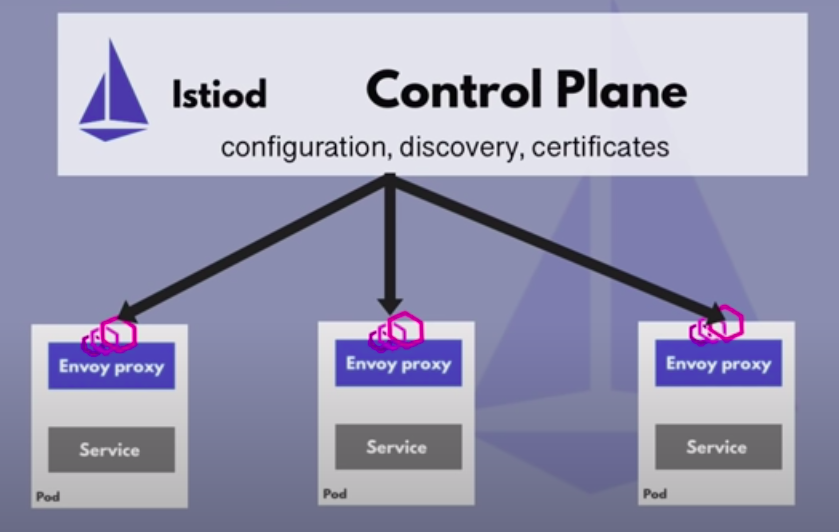
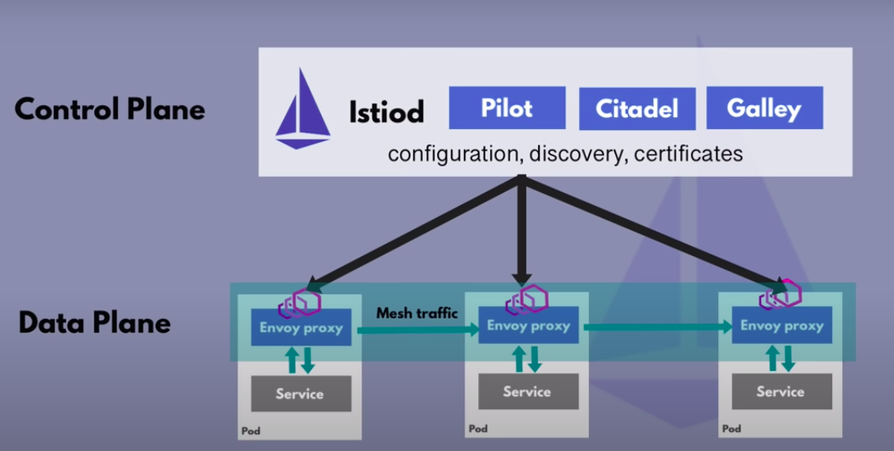
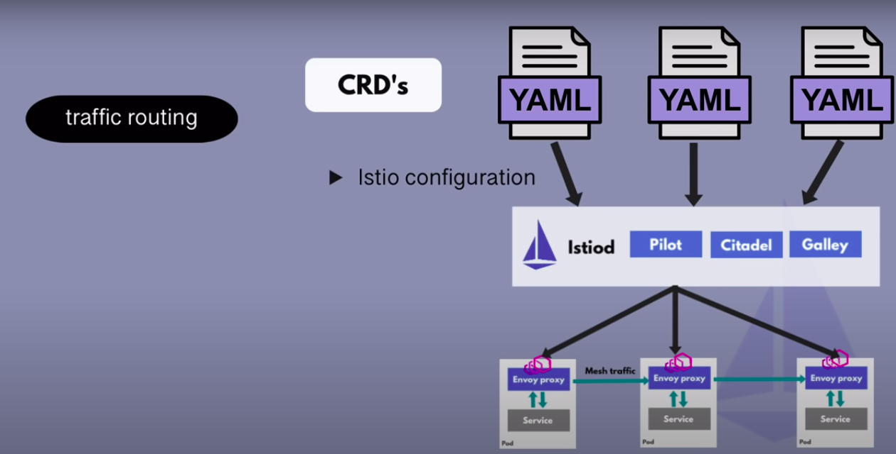

# Service Mesh

## Istio Architecture
* Service Mesh is a Pattern or Paradigm
* Istio is an implementation
* Envoy is the proxy of Istio

* Several components in earlier versions until v1.5
  * Pilot
  * Galley
  * Citadel
  * Mixer
* After that version Istiod got all these components

* How do we configure all these features for our microservice application?
  * You don't have to adjust Deployment and Service K8S YAML files
  * Istio configuration separate from application configuration
* Istio is configured with Kubernetes YAML files
  * Istio uses Kubernetes CustomResourceDefinition (CRD)

* CRD
  * Extending the Kubernetes API
  * Custom Kubernetes components/object for e.g. third-party technologies (like Istio, Prometheus, etc)
  * Can be used like any other native Kubernetes objects

